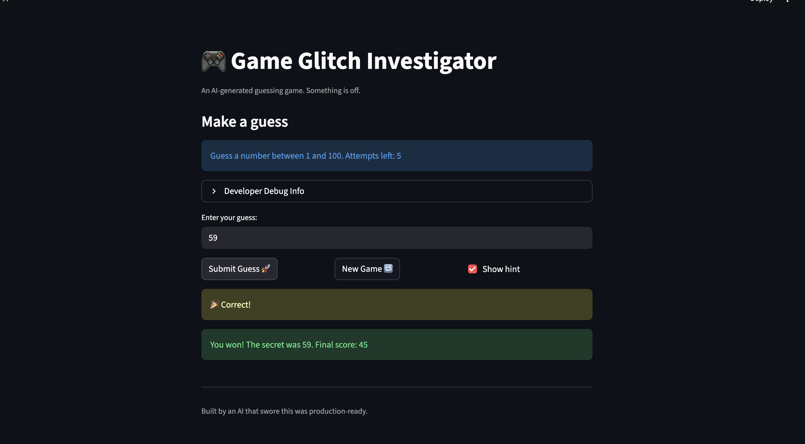

# 🎮 Game Glitch Investigator: The Impossible Guesser

## 🚨 The Situation

You asked an AI to build a simple "Number Guessing Game" using Streamlit.
It wrote the code, ran away, and now the game is unplayable. 

- You can't win.
- The hints lie to you.
- The secret number seems to have commitment issues.

## 🛠️ Setup

1. Install dependencies: `pip install -r requirements.txt`
2. Run the broken app: `python -m streamlit run app.py`

## 🕵️‍♂️ Your Mission

1. **Play the game.** Open the "Developer Debug Info" tab in the app to see the secret number. Try to win.
2. **Find the State Bug.** Why does the secret number change every time you click "Submit"? Ask ChatGPT: *"How do I keep a variable from resetting in Streamlit when I click a button?"*
3. **Fix the Logic.** The hints ("Higher/Lower") are wrong. Fix them.
4. **Refactor & Test.** - Move the logic into `logic_utils.py`.
   - Run `pytest` in your terminal.
   - Keep fixing until all tests pass!

## 📝 Document Your Experience

- [The game is a number guessing game where the player tries to guess a randomly selected secret number within a limited number of attempts. Hints are provided to guide the player whether their guess is too high or too low, and the game tracks a score based on performance.] Describe the game's purpose.

- [The secret number sometimes changed unexpectedly because it was converted to a string in certain cases, causing incorrect comparisons.

The hints ("Higher" / "Lower") were reversed or inconsistent, especially when the secret was compared as a string.

Starting a new game ignored the selected difficulty range and always generated numbers between 1 and 100.] Detail which bugs you found.

- [Removed string conversions so the secret number and guesses remain integers, fixing incorrect hint logic.

Updated check_guess() to provide consistent, correct hints for "Too High," "Too Low," and "Win."

Modified the new game logic to respect the chosen difficulty range.] Explain what fixes you applied.

## 📸 Demo

## 🚀 Stretch Features

- [ ] [If you choose to complete Challenge 4, insert a screenshot of your Enhanced Game UI here]
